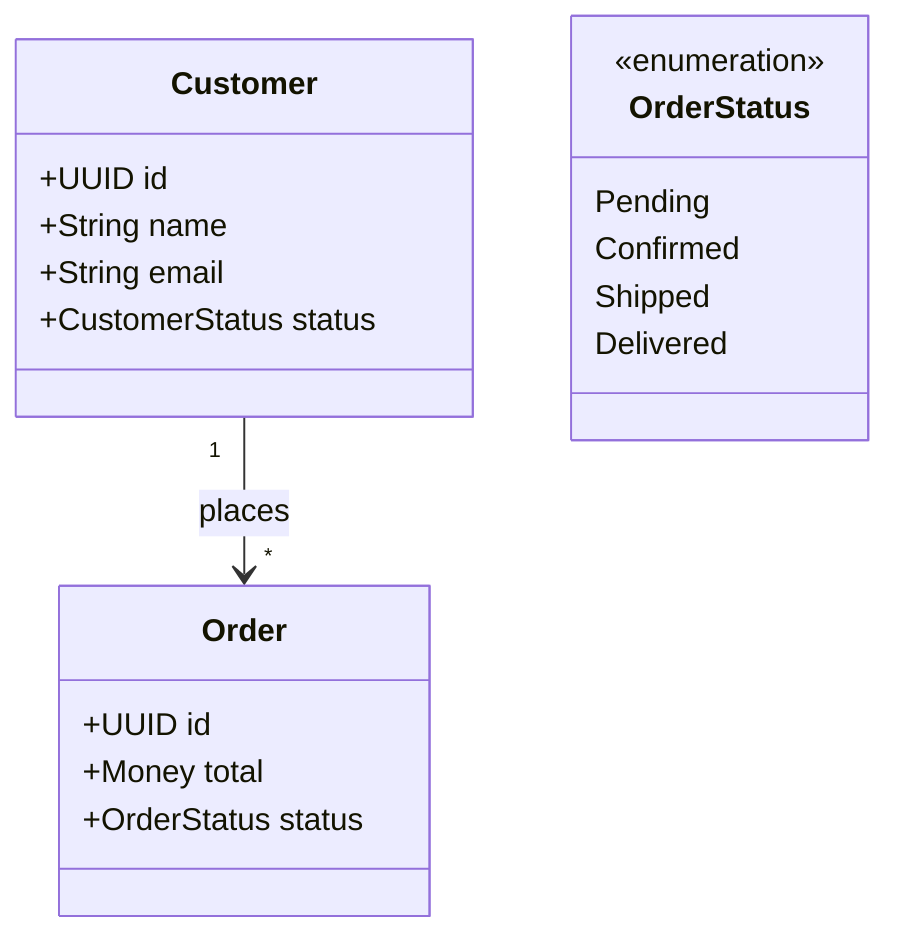
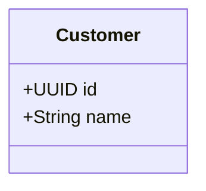
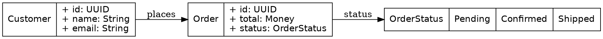

# Visualization

SketchDDD can generate visual diagrams from your domain model in multiple formats.

## Basic Usage

```bash
sketchddd viz model.sddd --format <FORMAT>
```

## Supported Formats

| Format | Description | Use Case |
|--------|-------------|----------|
| `mermaid` | Mermaid diagram syntax | Markdown docs, GitHub |
| `graphviz` / `dot` | Graphviz DOT format | PNG/SVG generation |

## Mermaid Diagrams

### Generate Mermaid

```bash
sketchddd viz domain.sddd --format mermaid
```

### Output



### Embed in Markdown

````markdown
# Domain Model


````

### GitHub Support

GitHub automatically renders Mermaid in markdown files. Just commit your diagram:

```bash
sketchddd viz domain.sddd -f mermaid > docs/diagram.md
git add docs/diagram.md
git commit -m "Update domain diagram"
```

## Graphviz Diagrams

### Generate DOT

```bash
sketchddd viz domain.sddd --format graphviz
```

### Output



### Generate Images

Using Graphviz tools:

```bash
# Generate PNG
sketchddd viz domain.sddd -f dot | dot -Tpng -o domain.png

# Generate SVG
sketchddd viz domain.sddd -f dot | dot -Tsvg -o domain.svg

# Generate PDF
sketchddd viz domain.sddd -f dot | dot -Tpdf -o domain.pdf
```

### Save to File First

```bash
sketchddd viz domain.sddd -f graphviz -o domain.dot
dot -Tpng domain.dot -o domain.png
```

## Visualization Features

### Entity Representation

Entities show:
- Name (header)
- ID field (highlighted)
- Other fields with types

```
┌─────────────────────┐
│      Customer       │
├─────────────────────┤
│ + id: UUID          │
│ + name: String      │
│ + email: Email      │
│ + status: Status    │
└─────────────────────┘
```

### Value Object Representation

Value objects are shown with structural emphasis:

```
┌─────────────────────┐
│   <<value>>         │
│      Address        │
├─────────────────────┤
│ + street: String    │
│ + city: String      │
│ + postalCode: String│
└─────────────────────┘
```

### Enum Representation

Enums show all variants:

```
┌─────────────────────┐
│  <<enumeration>>    │
│    OrderStatus      │
├─────────────────────┤
│ Pending             │
│ Confirmed           │
│ Shipped             │
│ Delivered           │
│ Cancelled           │
└─────────────────────┘
```

### Relationships

Arrows represent morphisms:

```
Customer ─────────> Order
           places
```

Cardinality is shown:
- `1` to `1`: Simple arrow
- `1` to `*`: Arrow with asterisk
- Optional: Dashed arrow

## Styling Tips

### Mermaid Themes

In your markdown:

````markdown
```mermaid
%%{init: {'theme': 'dark'}}%%
classDiagram
    ...
```
````

### Graphviz Styling

Edit the DOT output to customize:

```dot
digraph Commerce {
    // Graph attributes
    graph [bgcolor=white, fontname="Arial"];
    node [style=filled, fillcolor=lightblue];
    edge [fontsize=10];

    // ... rest of diagram
}
```

## Integration Examples

### Documentation Site

```bash
# In your docs build script
sketchddd viz src/domain.sddd -f mermaid > docs/images/domain.md
```

### CI/CD Pipeline

```yaml
# GitHub Actions
- name: Generate diagrams
  run: |
    sketchddd viz domain.sddd -f mermaid -o docs/domain.md
    sketchddd viz domain.sddd -f dot -o docs/domain.dot
    dot -Tpng docs/domain.dot -o docs/domain.png

- name: Commit diagrams
  run: |
    git add docs/
    git commit -m "Update domain diagrams" || true
```

### Live Reload

Watch for changes and regenerate:

```bash
# Using entr (install: brew install entr / apt install entr)
ls *.sddd | entr -c sketchddd viz domain.sddd -f mermaid
```

## Troubleshooting

### Large Diagrams

For large models, consider:

1. **Split by context**: Visualize one context at a time
2. **Filter**: Create focused views
3. **Use hierarchical layout**: `rankdir=TB` in Graphviz

### Graphviz Not Found

Install Graphviz:

```bash
# macOS
brew install graphviz

# Ubuntu/Debian
sudo apt install graphviz

# Windows (Chocolatey)
choco install graphviz
```

### Mermaid Rendering Issues

- Check syntax with [Mermaid Live Editor](https://mermaid.live)
- Ensure markdown processor supports Mermaid
- Try different themes if colors don't render
