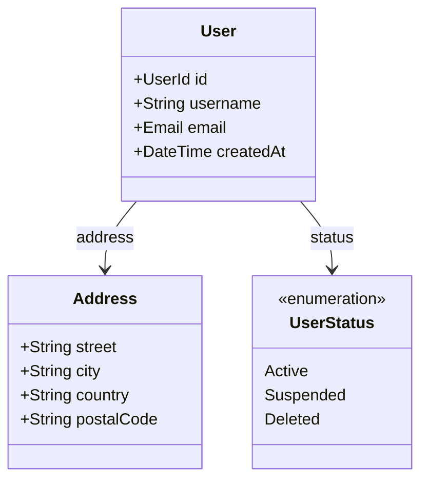

# Quick Start

This guide will get you up and running with SketchDDD in under 5 minutes.

## Create a New Project

Use the `init` command to create a new SketchDDD project:

```bash
sketchddd init my-domain
cd my-domain
```

This creates:

```
my-domain/
├── my-domain.sddd    # Your domain model
└── .sketchddd/       # Configuration (optional)
```

## Choose a Template

SketchDDD includes built-in templates:

```bash
# List available templates
sketchddd template list

# Initialize with e-commerce template
sketchddd init my-shop --template ecommerce

# Initialize with microservices template
sketchddd init my-system --template microservices
```

## Write Your First Model

Edit `my-domain.sddd`:

```sddd
context MyDomain {
  // Define an entity with identity
  entity User {
    id: UUID
    username: String
    email: Email
    createdAt: DateTime
  }

  // Define a value object (no identity)
  value Address {
    street: String
    city: String
    country: String
    postalCode: String
  }

  // Define an enum
  enum UserStatus = Active | Suspended | Deleted

  // Define relationships
  morphisms {
    address: User -> Address?
    status: User -> UserStatus
  }
}
```

## Validate Your Model

Check your model for errors:

```bash
sketchddd check my-domain.sddd
```

If everything is correct, you'll see:

```
✓ Checking my-domain.sddd...
✓ No issues found in 1 context
```

If there are errors, you'll get helpful messages:

```
error[E0002]: Unknown type 'Strin'
  --> my-domain.sddd:5:15
   |
 5 |     username: Strin
   |               ^^^^^ Did you mean 'String'?
```

## Generate Code

Generate code in your preferred language:

=== "Rust"
    ```bash
    sketchddd codegen my-domain.sddd --target rust
    ```

    Output:
    ```rust
    use uuid::Uuid;
    use chrono::{DateTime, Utc};

    #[derive(Debug, Clone, PartialEq, Eq)]
    pub struct UserId(pub Uuid);

    #[derive(Debug, Clone)]
    pub struct User {
        pub id: UserId,
        pub username: String,
        pub email: String,
        pub created_at: DateTime<Utc>,
        pub address: Option<Address>,
        pub status: UserStatus,
    }

    #[derive(Debug, Clone, PartialEq)]
    pub struct Address {
        pub street: String,
        pub city: String,
        pub country: String,
        pub postal_code: String,
    }

    #[derive(Debug, Clone, Copy, PartialEq, Eq)]
    pub enum UserStatus {
        Active,
        Suspended,
        Deleted,
    }
    ```

=== "TypeScript"
    ```bash
    sketchddd codegen my-domain.sddd --target typescript
    ```

    Output:
    ```typescript
    import { z } from 'zod';

    export type UserId = string & { readonly __brand: 'UserId' };

    export interface User {
      readonly id: UserId;
      readonly username: string;
      readonly email: string;
      readonly createdAt: Date;
      readonly address?: Address;
      readonly status: UserStatus;
    }

    export interface Address {
      readonly street: string;
      readonly city: string;
      readonly country: string;
      readonly postalCode: string;
    }

    export type UserStatus = 'Active' | 'Suspended' | 'Deleted';

    export const UserStatusSchema = z.enum(['Active', 'Suspended', 'Deleted']);
    ```

=== "Python"
    ```bash
    sketchddd codegen my-domain.sddd --target python
    ```

    Output:
    ```python
    from dataclasses import dataclass
    from typing import Optional, NewType
    from enum import Enum
    from datetime import datetime
    from uuid import UUID

    UserId = NewType('UserId', UUID)

    @dataclass(frozen=True)
    class Address:
        street: str
        city: str
        country: str
        postal_code: str

    class UserStatus(Enum):
        ACTIVE = "Active"
        SUSPENDED = "Suspended"
        DELETED = "Deleted"

    @dataclass
    class User:
        id: UserId
        username: str
        email: str
        created_at: datetime
        address: Optional[Address] = None
        status: UserStatus = UserStatus.ACTIVE
    ```

## Generate Diagrams

Visualize your model:

```bash
# Generate Mermaid diagram
sketchddd viz my-domain.sddd --format mermaid
```

Output:



## Auto-Detection

If you're in a directory with a `.sddd` file, you can omit the filename:

```bash
cd my-domain
sketchddd check    # Auto-detects my-domain.sddd
sketchddd codegen  # Auto-detects and generates Rust by default
```

## Next Steps

- [Your First Model](first-model.md) - Deep dive into modeling
- [Language Guide](../language/overview.md) - Complete language reference
- [Code Generation](../codegen/overview.md) - All code generation options
